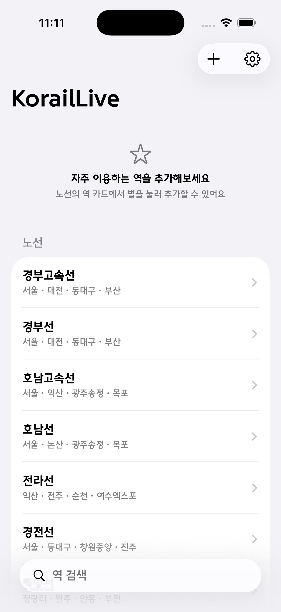
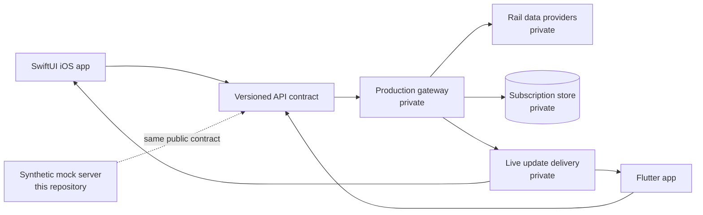

# KorailLive — Railway Journey Live Tracking

[](https://github.com/Ogunaru/KorailLive-portfolio/actions/workflows/ci.yml)

KorailLive는 열차를 선택하면 출발 시각, 지연, 타는 곳과 운행 위치를 잠금화면과 Live Activity에서 이어 보여 주는 개인 프로젝트입니다. 순수 SwiftUI iOS 앱에서 시작해 Node.js 서버와 Flutter 멀티플랫폼 앱으로 확장했습니다.

> 이 저장소는 채용 검토를 위한 공개 포트폴리오 버전입니다. 운영 데이터 제공자 연동, 인증 정보, 푸시 전송 엔진과 독자적인 운영 로직은 포함하지 않으며 모든 실행 예제는 합성 데이터를 사용합니다.

<p align="center">
  
</p>

## 제가 만든 것

| 영역 | 구현 내용 |
|---|---|
| Native iOS | SwiftUI, ActivityKit, WidgetKit, SwiftData, Keychain 기반의 iPhone/iPad 앱과 Live Activity |
| Cross-platform | Flutter UI와 상태 관리, Android Kotlin foreground service, iOS Swift ActivityKit bridge |
| Backend | Node.js API, MongoDB 구독 저장, 다단계 캐시, 상태 변경 감지와 APNs 갱신 |
| Reliability | 오래된 비동기 결과 차단, 요청 병합, 재시작 후 구독 복원, 실패 후 재시도, 입력 검증 |
| Verification | 운영 서버 단위 테스트 56개와 플랫폼별 모델·상태·UI 테스트 |

제품은 최대 3개의 여정을 동시에 추적합니다. 출발 전에는 타는 곳을, 출발 후에는 확정된 현재역과 다음역을 우선하며, 좌표 기반 정보는 명시적으로 추정값으로 분리합니다.

## 시스템 개요



클라이언트는 외부 철도 시스템을 직접 호출하지 않습니다. 서버가 제공자별 응답을 하나의 계약으로 정규화하고, 앱은 동일한 Unix timestamp·KST·상태 전환 규칙을 공유합니다. 자세한 내용은 [아키텍처 문서](docs/architecture.md)와 [기술적 의사결정](docs/engineering-decisions.md)에 정리했습니다.

## 공개 샘플

이 저장소의 샘플은 운영 소스의 단순 복사본이 아니라, 핵심 엔지니어링 문제를 합성 데이터로 재현한 검토 가능한 코드입니다.

| 샘플 | 보여 주는 역량 | 실행 |
|---|---|---|
| [`samples/server`](samples/server) | API 계약, 입력 검증, TTL 캐시, 동시 요청 병합 | `npm test` |
| [`samples/ios`](samples/ios) | 단일 상태 전환 규칙, 자정 통과 시각표 정규화, actor 기반 세대 제어 | `swift test` |
| [`samples/flutter`](samples/flutter) | 동일 규칙의 Dart 구현, 플랫폼 독립 도메인 모델, revision gate | `dart test` |
| [`contracts/openapi.yaml`](contracts/openapi.yaml) | 클라이언트와 서버 사이의 공개 계약 | OpenAPI 3.1 |

Mock API 실행:

```bash
cd samples/server
npm start
curl http://localhost:3000/stations
```

Mock API는 운영 도메인으로 연결되지 않으며 네트워크 의존성 없이 고정된 샘플 응답만 반환합니다.

## 공개하지 않은 범위

- 실제 철도 데이터 제공자 endpoint, 요청 헤더와 응답 정규화 구현
- 운영 서버 주소, 데이터베이스 연결 및 배포 인프라
- APNs/FCM 인증·서명·전송 구현과 디바이스 토큰
- 전체 제품 소스와 독자적인 운영·사업 로직
- 배포 권한을 확인하지 않은 서체, 앱 아이콘과 제3자 원본 데이터

세부 기준은 [공개 경계 문서](docs/public-boundary.md)에 있으며, CI에서 금지된 도메인·자격 증명 패턴·민감 파일 확장자를 검사합니다.

로컬에서 수행한 검사와 환경별 한계는 [검증 기록](docs/verification.md)에 남겼습니다.

## 검토 포인트

- 하나의 상태 규칙을 Swift·Dart·서버에 일관되게 적용한 방식
- 여러 비동기 요청이 역순으로 끝날 때 오래된 결과가 최신 상태를 덮지 않게 한 방식
- 캐시와 진행 중 요청을 공유해 외부 시스템 부하를 줄인 방식
- 앱 재실행, 토큰 회전, 일시적 푸시 실패를 정상 흐름으로 다룬 방식
- iPhone, iPad, Dynamic Island, 잠금화면, Android ongoing notification의 서로 다른 제약을 모델 계약 하나로 연결한 방식

원본 저장소는 비공개로 유지하며, 면접에서는 선택한 흐름의 코드 워크스루와 설계 트레이드오프를 설명할 수 있습니다.

## 사용 범위

이 저장소는 소스 검토용 포트폴리오이며 오픈소스 라이선스를 부여하지 않습니다. 자세한 내용은 [NOTICE.md](NOTICE.md)를 확인해 주세요.

KorailLive는 철도 운영사에서 제공하거나 보증하는 공식 앱이 아닙니다.
