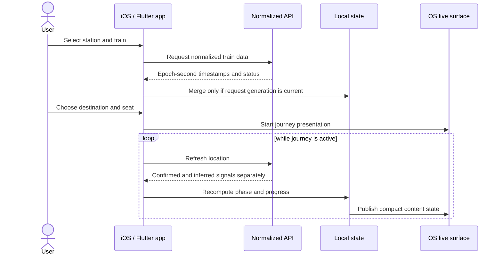

# Architecture

## Production shape

KorailLive는 세 개의 비공개 운영 저장소로 개발했습니다.

```text
Native iOS (SwiftUI)
  ├─ SwiftData / UserDefaults / Keychain
  ├─ ActivityKit + WidgetKit
  └─ server API client

Flutter application
  ├─ shared Dart presentation and domain state
  ├─ Android Kotlin foreground service
  └─ iOS Swift ActivityKit bridge

Node.js service
  ├─ versioned normalized API
  ├─ request-coalescing caches
  ├─ subscription persistence
  └─ background live-update delivery
```

공개 저장소에는 이 구조의 경계와 대표 알고리즘만 남기고, 운영 gateway 내부는 검은 상자로 취급합니다.

## Search-to-live-update flow



## Shared invariants

### Time

- API 시간은 Unix timestamp 초 단위입니다.
- 운행일 계산과 사용자 표시는 `Asia/Seoul` 기준입니다.
- 상태 전환 기준은 `예정 출발 시각 + 지연` 하나만 사용합니다.
- 시각표가 자정을 넘을 때 시각이 역행하면 다음 날짜로 정규화합니다.

### State ownership

- 서버 응답이 제공하는 단계가 권위값입니다.
- 앱의 초기 상태도 같은 임계값으로 계산해 첫 화면의 점프를 방지합니다.
- 확정된 현재역·다음역과 좌표 기반 최근접역 추정은 서로 다른 필드로 유지합니다.
- 비동기 작업은 generation 또는 revision을 확인한 뒤에만 상태를 commit합니다.

### Failure handling

- 캐시는 값뿐 아니라 진행 중인 요청도 공유해 동일 키의 중복 조회를 병합합니다.
- 일시적인 upstream 또는 push 실패는 종료 신호가 아니라 재시도 가능한 상태입니다.
- 앱 재시작 시 로컬 여정, OS live surface와 서버 구독을 대조해 복원합니다.

## Public sample mapping

| Production concern | Public equivalent |
|---|---|
| Provider-specific adapters | Deterministic fixtures in `samples/server` |
| Multi-TTL caches | Dependency-free `TTLCache` with request coalescing |
| SwiftUI/ActivityKit state | Pure Swift journey policy and generation gate |
| Flutter/native bridge state | Pure Dart policy and revision gate |
| Client/server payloads | Sanitized OpenAPI contract |

이 구성은 채용 검토자가 동시성·상태·계약 설계를 실행해 볼 수 있게 하면서 운영 접근법을 재현하는 데 필요한 세부사항은 제공하지 않습니다.
